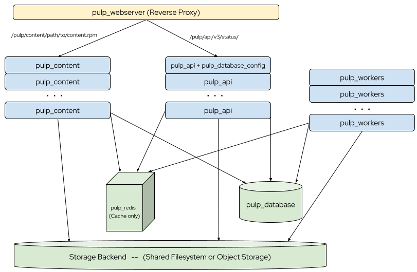

Pulp 3 Ansible Installer
========================

The Pulp 3 Ansible installer is a collection of Ansible roles that you can use to install or upgrade Pulp 3, or add [plugins](https://pulpproject.org/content-plugins/) to an existing installation.

Each Ansible role installs and configures a component of Pulp, or other services required by Pulp (PostgreSQL, Redis and a webserver.)

This version of the installer, 3.20.2, installs the latest release of pulpcore 3.20.z.

If run against an older version of Pulp 3, it will upgrade it to 3.20.z.

If run again, the installed version of pulpcore 3.20 is not updated unless `pulpcore_update` is set to `true`.

---
**Didn't find what you need to get started?**

We are actively trying to make our documentation as complete and user-friendly as possible.
If you experience any difficulties or have any feedback, please post to our [community forum](https://discourse.pulpproject.org/) and let us know.
We would be very happy to hear from you.
[Documentation PRs](https://github.com/pulp/pulp_installer/edit/main/docs/index.md) are always welcome.
---

Architecture
------------
The installer can be run [against a cluster](clustering), or against a [single host (server)](quickstart). The following is a diagram of
a cluster with all the different services of pulp_installer on different hosts, and some services on
multiple hosts.



* Traffic comes into front-end host configured by the role [`pulp_webserver`](roles/pulp_webserver) from
  your clients. Although not pictured, more than one pulp webserver can be deployed by the installer, but for
  some content plugins, this would require a load balancer.
* Content traffic (e.g., downloading software packages from package managers like `dnf` or `pip`) gets
  proxied to one or more hosts configured by the role [`pulp_content`](roles/pulp_content)
* API traffic (e.g., uploading packages) gets proxied to one or more hosts configured by the role
  [`pulp_api`](roles/pulp_api).
* One or more hosts are configured by the [`pulp_workers`](roles/pulp_workers) role to do tasks like
  synchronize repositories.
* The content is stored on the "Storage backend", either a shared filesystem (like NFS) or
  [object storage](objectstorage). Or if there is a single pulp_api/pulp_content/pulp_workers server, a
  single folder on disk (/var/lib/pulp).
* The rest of the state of the application is stored on a PostgreSQL host configured by the
  [`pulp_database`](roles/pulp_database) role. Although not pictured, this can be an existing
  [PostgreSQL](https://www.postgresql.org) host/cluster. 
* In order to improve performance, a Redis host configured by the [`pulp_redis`](roles/pulp_redis) serves
  as a cache. Although not pictured, this can be an existing [Redis](https://redis.io) host/cluster. 

More information on the architecture is available in the [main Pulp docs](https://docs.pulpproject.org/pulpcore/components.html).

System Requirements
-------------------

Before you install Pulp, review the [architecture and component documentation](https://docs.pulpproject.org/pulpcore/components.html#) to ensure you understand the deployment structure and concepts.

The Ansible [control node](https://docs.ansible.com/ansible/2.5/network/getting_started/basic_concepts.html#control-node)
(i.e., your workstation) must have Python (>= 2.7) and Ansible (>= 2.9) installed.

Ensure that your server meets the [hardware requirements](https://docs.pulpproject.org/pulpcore/installation/hardware-requirements.html) to install and run Pulp.

Ensure that your server, AKA the Ansible [managed node](https://docs.ansible.com/ansible/2.5/network/getting_started/basic_concepts.html#managed-nodes),
runs one of these currently supported operating systems:

- CentOS/RHEL 7, 8 or 9
- Debian 11 Bullseye (needs `allow_world_readable_tmpfiles = True` in ansible.cfg)
- Fedora 32 or later

The server cannot provide any other HTTP (port 80, 443) service on the same hostname as Pulp's API. The only
exception is Pulp 2. The REST APIs for Pulp 2 and Pulp 3 can be served on the same hostname as
long as the `apache` webserver is deployed for both.

NOTE: These server requirements assume you are deploying Pulp to a single server. If you are deploying it
to a cluster (with multiple tiers), the hardware requirements will differ, and only the webserver
(`pulp_webserver` role) will have the service limitation. Each node must run a supported operating
system from the list above, but each node can run a different OS.

If you are using an existing PostgreSQL host/cluster, version 10 or higher is required.

If you are using an existing Redis host/cluster, version 3 or higher is required.

The Ansible collection requires [geerlingguy.postgresql](https://galaxy.ansible.com/geerlingguy/postgresql) role,
which you can install on the Ansible control node from ansible-galaxy.

```bash
ansible-galaxy install geerlingguy.postgresql
```

Ansible Boilerplate
-------------------

This [collection](https://docs.ansible.com/ansible/latest/user_guide/collections_using.html) of roles can be used against any [managed node](https://docs.ansible.com/ansible/latest/network/getting_started/basic_concepts.html#managed-nodes) (host/server) and are highly configurable.  Knowledge of
[ansible basics](https://docs.ansible.com/ansible/2.5/user_guide/intro_getting_started.html) will
be helpful, but even if you are new to Ansible, this section will get you started, or you can try
the Vagrant installations to bypass the Ansible boilerplate.

First, you will need to configure SSH between your control node and your managed node. With Ansible, typically this is done via the following to eliminate the need to enter a password:

```bash
ssh-copy-id <managed_node_username>@<managed_node>
```

When you can SSH into the managed node without a password, you are ready to move to the next step.

Ensure that Ansible can communicate with the managed node.

```bash
ansible all -i <managed_node>, -m ping -u <managed_node_username>
```

Also, like many Ansible roles/collections, these roles are idempotent.

Roles
-----

`pulp_installer` is equipped with the following roles:

- [pulp_common](helper_roles/pulp_common): installs shared components of the Pulp 3 services from PyPi or source and provides basic config
- [pulp_api](roles/pulp_api): install, configure, and set the state of pulp API service.
- [pulp_content](roles/pulp_content): install, configure, and set the state of pulp content app.
- [pulp_database](roles/pulp_database): install a PostgreSQL database server for Pulp 3.
- [pulp_database_config](roles/pulp_database_config): configure the database for Pulp 3.
- [pulp_health_check](roles/pulp_health_check): Verify that Pulp Services are up and listening.
- [pulp_redis](roles/pulp_redis): install and start Redis for Pulp 3.
- [pulp_webserver](roles/pulp_webserver): install, configure, start, and enable a front-end web server that combines pulp_api and pulp_content into 1 service.
- [pulp_workers](roles/pulp_workers): install, configure, and set the state of pulp workers.
- [pulp_devel](roles/pulp_devel): installs useful tools and adds some config files for a Pulp 3 development environment.

`pulp_installer` also is equipped with these helper roles for pulp_common:

- [galaxy_post_install](helper_roles/galaxy_post_install): This roles provides post-install configuration for the galaxy-ng plugin.
- [pulp_rpm_prerequisites](helper_roles/pulp_rpm_prerequisites): This role installs prerequisite python packages and prerequisite linux distribution packages for the pulp-rpm plugin.
- [pulp_repos](helper_roles/pulp_repos) Role to enable repositories needed to install pulp. It can be disabled if user already have the repositories enabled.


`pulp_installer` also provides the following meta roles, which depend on a set of other roles. These provide
the convenience of writing playbooks that specify one role, rather than a list of roles that often changes.

- [pulp_all_services](meta_roles/pulp_all_services/): A role to install all Pulp services (first-party & third-party) on a single host.
- [pulp_services](meta_roles/pulp_services/): A role to install & configure Pulp's
  first-party services (including the state of the Pulp database) on a single host.
